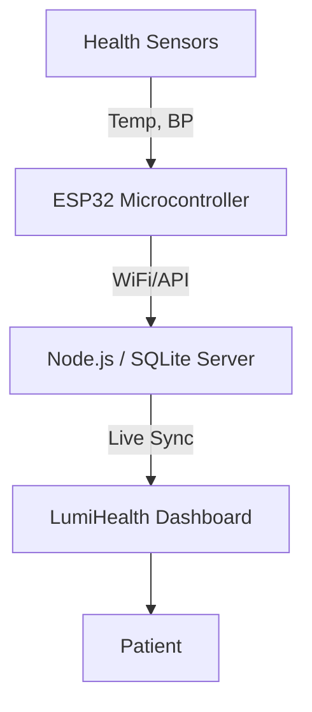

# 🌟 LumiHealth

LumiHealth is a premium, feature-rich healthcare web platform designed to provide a seamless patient experience. Patients can manage their health records, track vitals, book specialist appointments, and communicate directly with medical professionals through an intuitive, modern, glassmorphism-inspired UI.


---

## 🚀 Features

*   **Secure Authentication:** End-to-end user registration and login flows with password hashing (`bcryptjs`) and local session capabilities.
*   **Appointment Booking:** Dynamic scheduling system linked up to underlying SQLite database to book, list, and softly cancel medical visits.
*   **User Dashboard:** A central hub providing an overview of health metrics, upcoming appointments, and recent notifications.
*   **Feature-Based Architecture:** Beautifully isolated frontend and backend environments spanning isolated modules (auth, appointments, medical core).
*   **Elegant UI/UX:** Built with a "glassmorphism" aesthetic, utilizing carefully curated color palettes (Blues and Emeralds), subtle micro-animations, and the 'Outfit' font family.
*   **Future IoT Integration:** Extensible architecture ready to sync real-time BP and Temp sensor data from microcontrollers (e.g., ESP32).

---

## 📂 Project Structure

LumiHealth has been built with an ultra-clean **Feature-Based Architecture**. 

Every feature encompasses its respective frontend view and backend route to keep the project highly modular and scalable:

```text
LumiHealth/
├── src/
│   ├── config/                # Database configurations (SQLite3)
│   │   └── database.js
│   ├── features/
│   │   ├── appointments/      # Appointments logic & views
│   │   │   ├── appointments.routes.js   
│   │   │   ├── appointments.html        
│   │   │   └── appointment-history.html
│   │   ├── auth/              # Authentication logic & views
│   │   │   ├── auth.routes.js           
│   │   │   ├── login.html               
│   │   │   └── signup.html
│   │   ├── dashboard/         # End-user central dash
│   │   │   └── dashboard.html
│   │   ├── medical/           # Medical tracking & records
│   │   │   └── records.html
│   │   ├── user/              # Account preferences & profiles
│   │   │   └── profile.html
│   │   ├── core/              # Main Landing page
│   │   │   └── index.html
│   │   └── support/           # AI interactions
│   │       └── chatbot.html
├── server.js                  # Master Express entry point
└── database.sqlite            # Live SQLite database file
```

---

## 🛠️ Technology Stack

*   **Frontend:** Vanilla HTML5, CSS3, JavaScript
*   **Backend framework:** Node.js, Express.js
*   **Database:** SQLite3
*   **Security:** bcryptjs
*   **Routing:** Express Routers mounted dynamically to feature static directories

---

## 💻 Getting Started

### 1. Prerequisites
Ensure you have the following installed on your local machine:
*   [Node.js](https://nodejs.org/en/) (v14 or higher)
*   npm (Node Package Manager)

### 2. Installation

Clone the repository and install the backend modules:
```bash
# Navigate to the project directory
cd Health_one

# Install necessary Node modules
npm install
```

### 3. Run the Application

Start the Express web server natively:
```bash
node server.js
```

You should see:
```bash
Server is running on http://localhost:8080
Connected to the SQLite database.
```

Visit [http://localhost:8080](http://localhost:8080) directly in your browser.

---

## 📡 Future System Architecture (IoT Integration)

The end-goal of LumiHealth is to seamlessly integrate with real-time physical medical sensors:



## 🤝 Contribution
Contributions, issues, and feature requests are welcome! 
Feel free to check out the [issues page](https://github.com/your-repo/issues) to contribute.

---
*Crafted with precision for the future of healthcare technology.*
